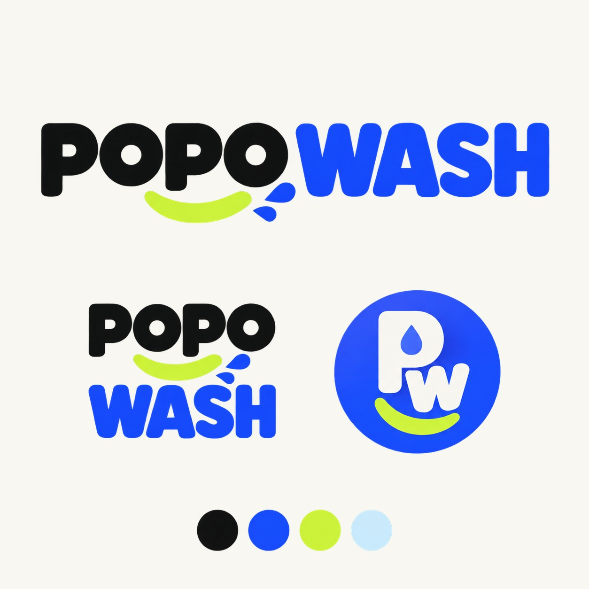
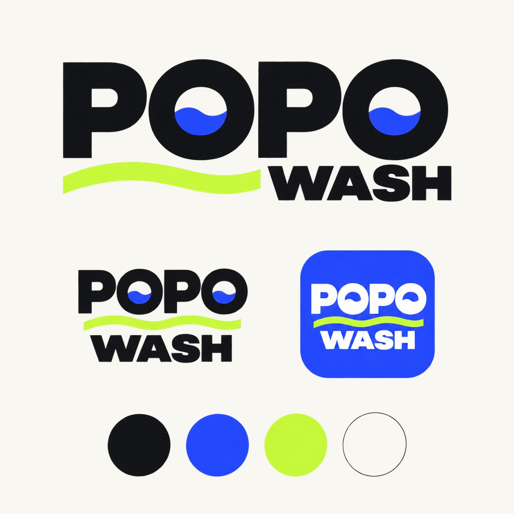
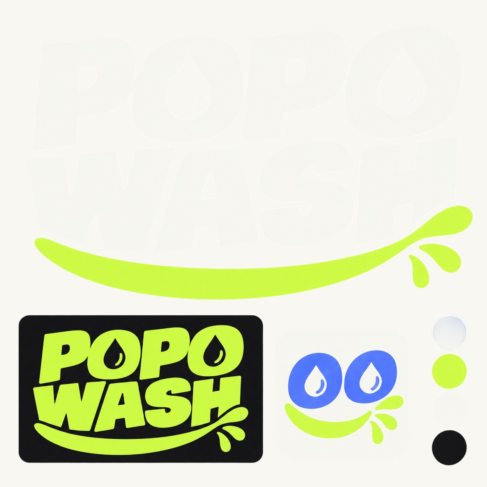
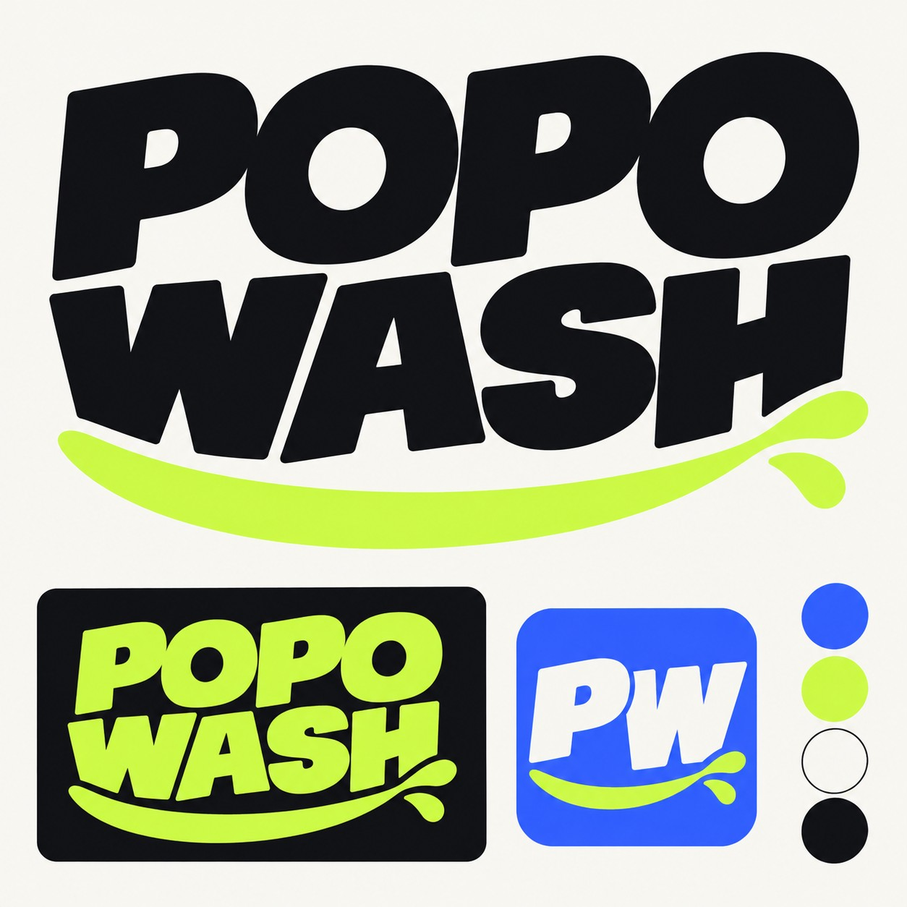

# Propuestas de identidad PopoWash

Los PNG originales conservan transparencia para futuros usos. Estas vistas JPG usan el fondo blanco cálido de la identidad para que los conceptos se puedan revisar correctamente en GitHub, incluso con el tema oscuro.

## Concepto 1

## Concepto 2 — Editorial

## Concepto 3 — Campaña

## Concepto 4 — Apilado limpio

